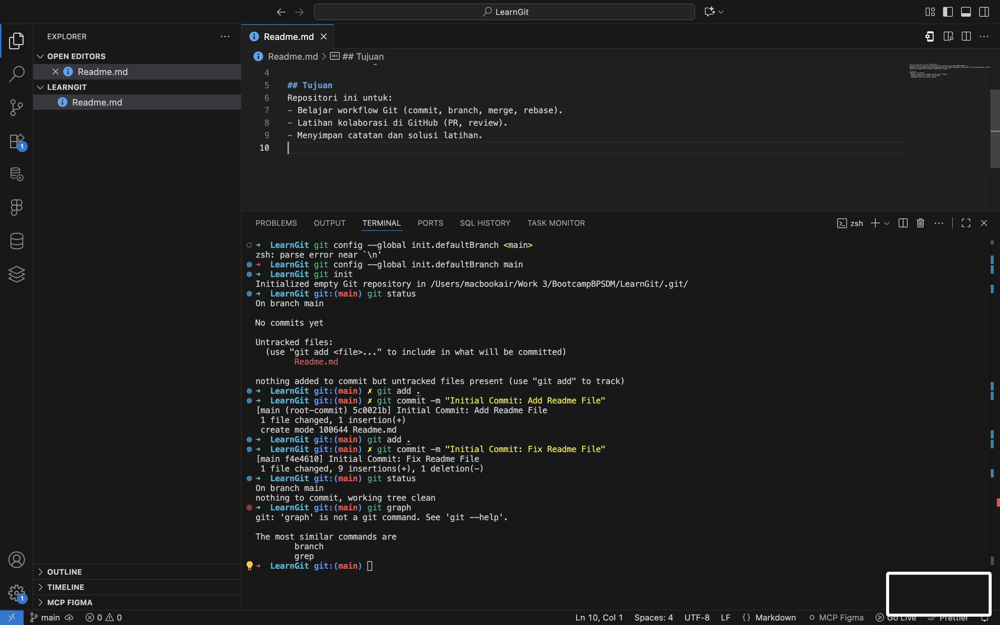
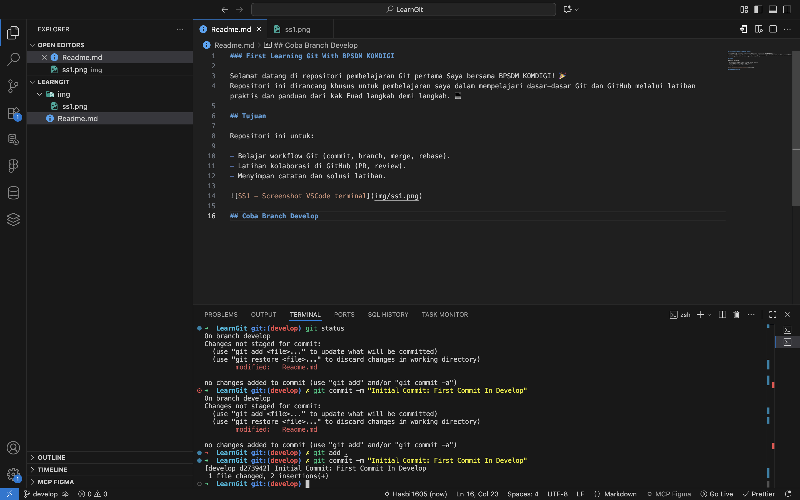
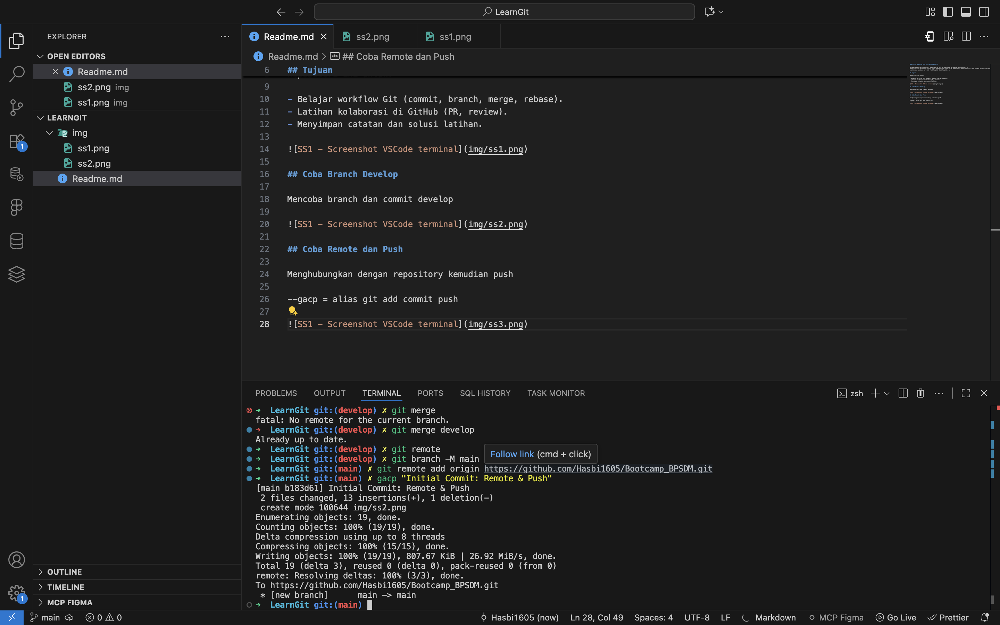

### First Learning Git With BPSDM KOMDIGI

Selamat datang di repositori pembelajaran Git pertama Saya bersama BPSDM KOMDIGI! 🎉  
Repositori ini dirancang khusus untuk pembelajaran saya dalam mempelajari dasar-dasar Git dan GitHub melalui latihan praktis dan panduan dari kak Fuad langkah demi langkah. 💻

## Tujuan

Repositori ini untuk:

- Belajar workflow Git (commit, branch, merge, rebase).
- Latihan kolaborasi di GitHub (PR, review).
- Menyimpan catatan dan solusi latihan.

## Coba Branch Develop

Mencoba branch dan commit develop

## Coba Remote dan Push

Menghubungkan dengan repository kemudian push

--gacp = alias git add commit push

## Mencoba Checkout Main dan fix screenshot 3 di branch main